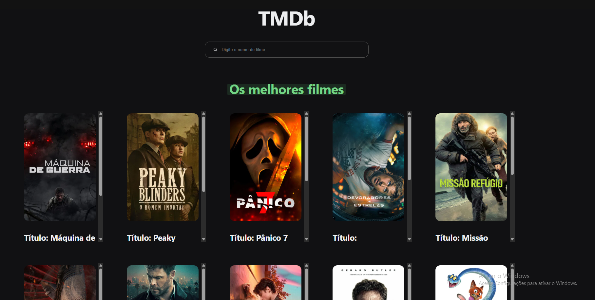

## App pesquisa de filme

Projeto utilizando a api do TMDb para exibir os melhores filmes e buscar por um filme especifico, ele está responsivo a qualquer tamanho de tela

### ⚙️ Acesar o projeto

[Endereço](app-pesquisa-de-filmes.vercel.app)

### 🛠️ Tecnologias utilizadas

- HTML

- CSS

- TYPESCRIPT

- REACT

- API

### 🙋🏻‍♂️ AUTOR

João Vitor - Fullstack do projeto - [Github](https://github.com/JoaoVitor2004)

### Licensa

Este projeto foi feito com a licensa [MIT](https://pt.wikipedia.org/wiki/Licen%C3%A7a_MIT)